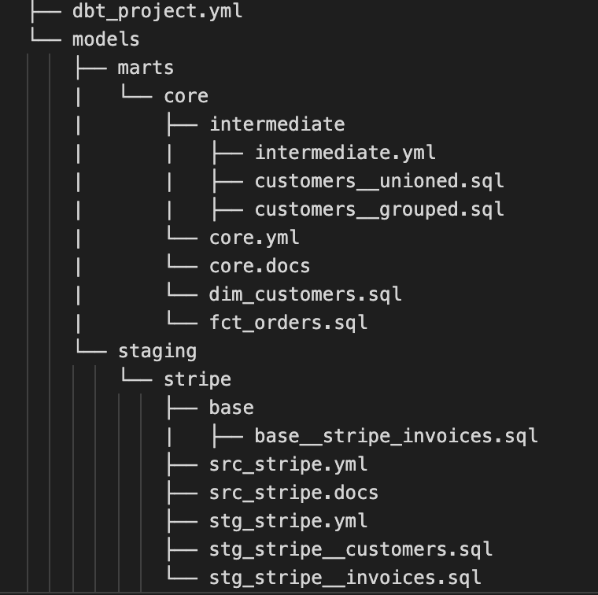

Welcome to the demo dbt project based on e-commerce Kaggle dataset (https://www.kaggle.com/carrie1/ecommerce-data)

### 1) Add a connection to Big Query
 - Create a file in the `~/.dbt/` directory named `profiles.yml`.
 - Move your BigQuery keyfile into this directory. 
 - Copy the following into the file — make sure you update the values where indicated.

Example of a profiles.yml file:

```yaml
dbt_demo: # this needs to match the profile: in your dbt_project.yml file
  target: dev
  outputs:
    dev:
      type: bigquery
      method: service-account
      keyfile: /Users/aubin/.dbt/dbt-user-creds.json # replace this with the full path to your keyfile
      project: toy_project # Replace this with your project id
      dataset: ecommerce # Replace this with dbt_your_name, e.g. dbt_bob
      threads: 1
      timeout_seconds: 300
      location: north-europe
      priority: interactive
```

### 2- Add source datasets
Source are tables loaded by ingestion tools into the DWH. ⇒ a source can be composed by multiple tables.
Sources are defined in .yml files nested under a sources: key. 

### 3- Add models
A model is a single .sql file. Each model contains a single select statement that either transforms raw data into a dataset that is ready for analytics, or, more often, is an intermediate step in such a transformation.
In this example, we are complying to the dbt official style guide (https://github.com/dbt-labs/corp/blob/master/dbt_style_guide.md) with the following structure:

<br>

<br>
<br>

### 4- Run project and add tests/documentation
- dbt run
- dbt run --target prod
- dbt test
- dbt docs generate / dbt docs serve
